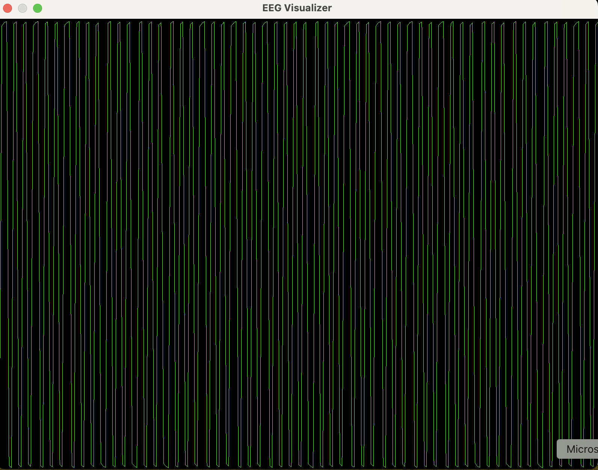
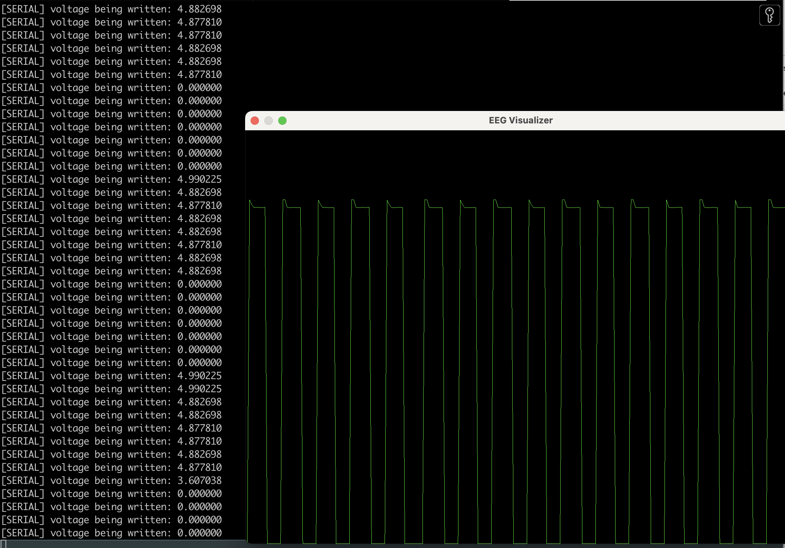

## Square-Wave Only Circuit
For the purpose of testing the data capture (the crude oscilloscope that I wrote in Metal), the Arduino Uno
is used to generate a square wave with 50% duty cycle from pin 9. Pin 9 is then 
connected directly to Pin A0 which sends the signal to the ADC on the ATmega328P chip and then 
to the serial port. The ATmega328P runs at 16MHz which is the clock speed for the ADC. However, the 
ADC clock speed can be divided by a prescaler value, which by default is 128. So, the ADC clock is 
really (see https://www.gammon.com.au/adc for this info):

ADC Clock frequency = 16 MHz/128  = 125 kHZ

And the inverse of this gives the amount of time for one clock cycle:

ADC Clock cycle period = 1 / 125 kHz = 8 microseconds

But it takes 13 clock cycles for a single analog-to-digital-conversion, which gives

Time for one conversion = 13 * 8 microsecond = 104 microseconds 

Which gives a sampling rate (ignoring first sample which takes 25 clock cycles to initialize registers and such) of 

Pin A0 sampling rate ~ 1 / 104 microseconds = 9.6 kHz.

Which is more than fast enough to sample a 490 Hz square wave to avoid aliasing. We can see from the picture of
the signal below that it is a square wave with the correct duty cycle. I should add a y-axis into the EEG visualizater (TODO). 

Check the [arduino sketch](../firmware/arduino_read_square_wave/arduino_read_square_wave.ino)
to see how to generate the square wave. 

Now, a bit later, I ended up using an AWG for generating the square wave, so the pic below show this. 
The AWG generated a cleaner signal than the Uno. 

