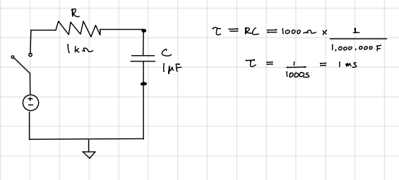
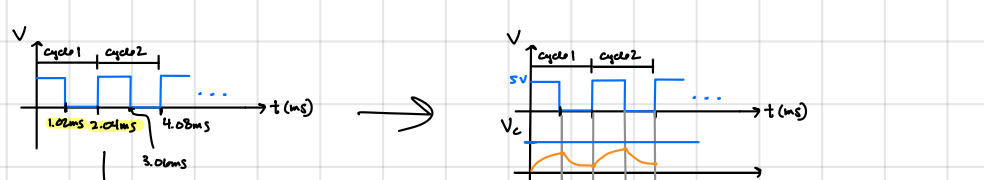
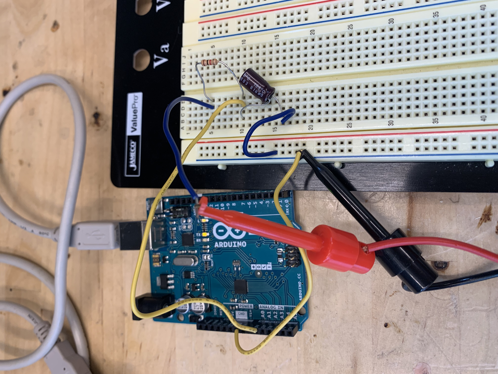
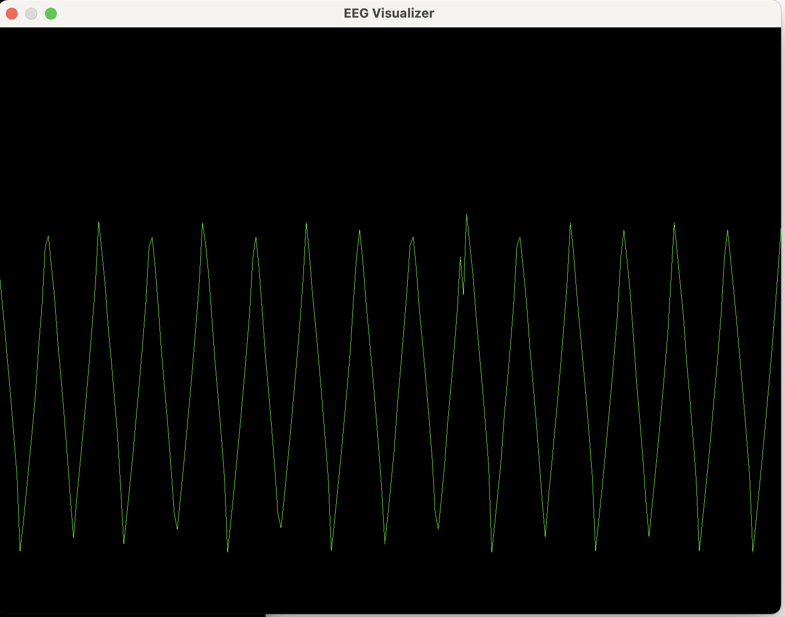

## Low-Pass Filter Circuit
In theory, it's possible to turn the square wave into a sine wave.  Here we will examine this by passing the square
wave from above into a simple RC circuit, also called a 'low-pass filter' circuit.  This consists of a resistor 
connected in series with a capacitor. 

I've chosen R = 1 kOhm   and C = 1 microFarad which gives a time constant tau = 1ms. This should be very close to the frequency of
the square wave which is 490 kHz coming from pin 9 of the Uno. (Note, this is not the sampling frequency as discussed above).
Square wave frequency of 490 Hz corresponds to a period of 2.04 ms, so having a time constant of 1ms gives us the right amount of timing
to modulate one pulse of the square wave. [Working through the calculation](RC_circuit.pdf)  we can see that our smoothed square wave will oscillate 
between about 1.3 V to 3.7 V. 

 
(Obsolete: Use the same [arduino sketch](../firmware/arduino_read_square_wave/arduino_read_square_wave.ino) as above.) The pic 
below was generated using the AWG in the lab. 
### Pic of Circuit:

Measuring the voltage across the capacitor and visualizing, we see that the voltage is modulated away from a square wave to something
resembling more sinusoidal (although it's still rather sharp and irregular). 
### Pic of Signal:

