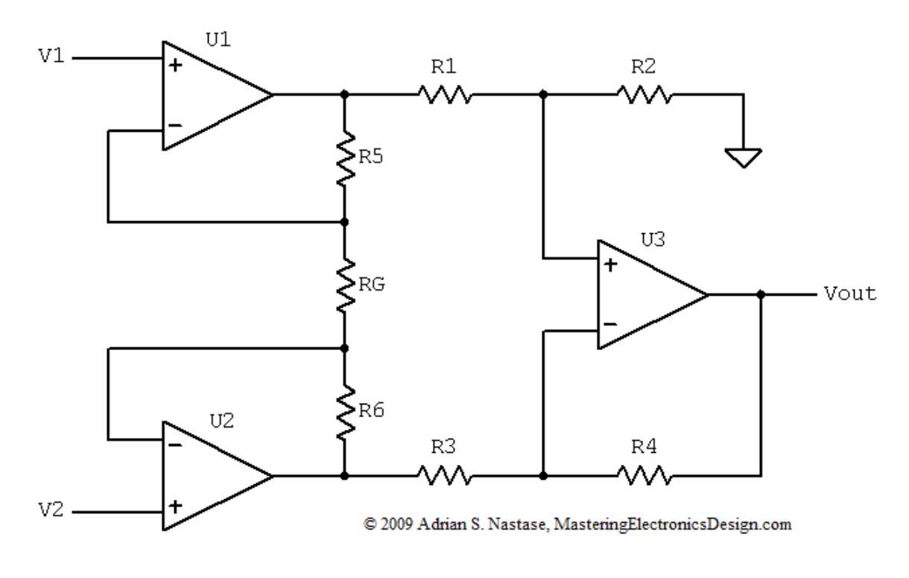
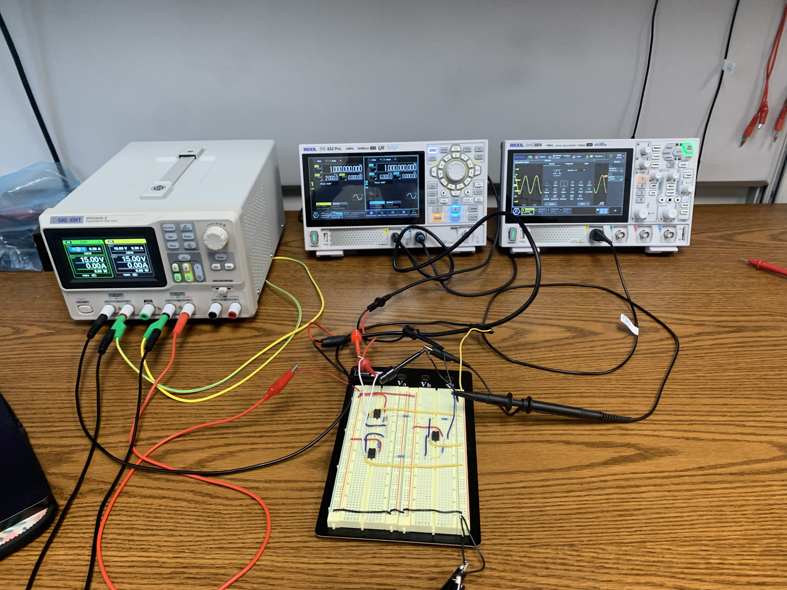
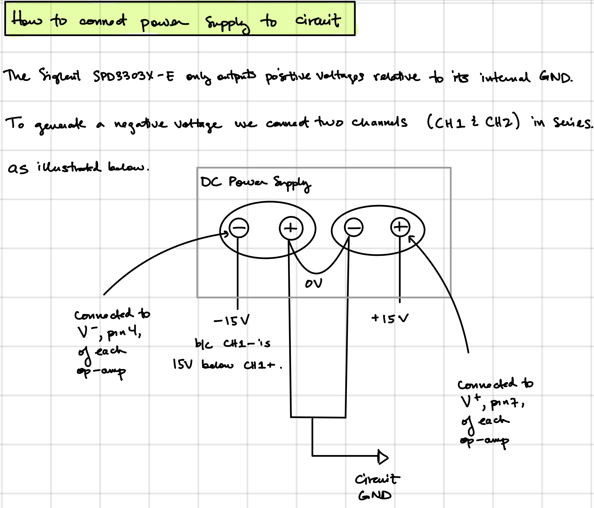

# Instrumentation Amplifier 

The next circuit to test is the  instrumentation amplifier design which is borrowed from [this writeup](../../documentation/Design_of_Instrumentation_amplifier.pdf)
and reproduced below. 

I [derived](./voltage_gain_derivation.pdf) the gain of this amplifier and verified that it matched was found in the document above. If all resistors except
$R_G$ have the same resitance R, the gain becomes

$V_\text{out} = (V_1 - V_2)\left(1 + 2\frac{R}{R_G}\right)$

I chose $R=20k\Omega$ and $R=100\Omega$ which will yield a gain of about 400 times.

## Circuit
I wired up the circuit on a breadboard using three LM741 op-amps. These are quite old, cheap op-amps but they are all that I had. 
These require a large DC voltage for power so this instrumetnation amplifier is not suitable for plugging into the Arduino and then into my MacBook. I am also
not willing to connect sensors from my scalp to this circuit. So, to measure the output voltage I used an oscilloscope and to simulate EEG signals I used an 
Arbitrary Waveform Generator to create low voltage oscillating signals as input voltages $V_1$ and $V_2$.  

The DC supply is unable to output a negative voltage so to create a $-15V$ I created an artificial ground by connecting CH1+ to CH2- and wiring those both 
to the ground of the breadboard. CH1- is wired to the negative voltage supply (pin 4) of each op-amp and CH2+ is wired to the positive voltage supply (pin 7)
of each op-amp via the red wires which are connected to two of the power rails on the breadboard..  

A close-up of the circuit wiring is shown below.

