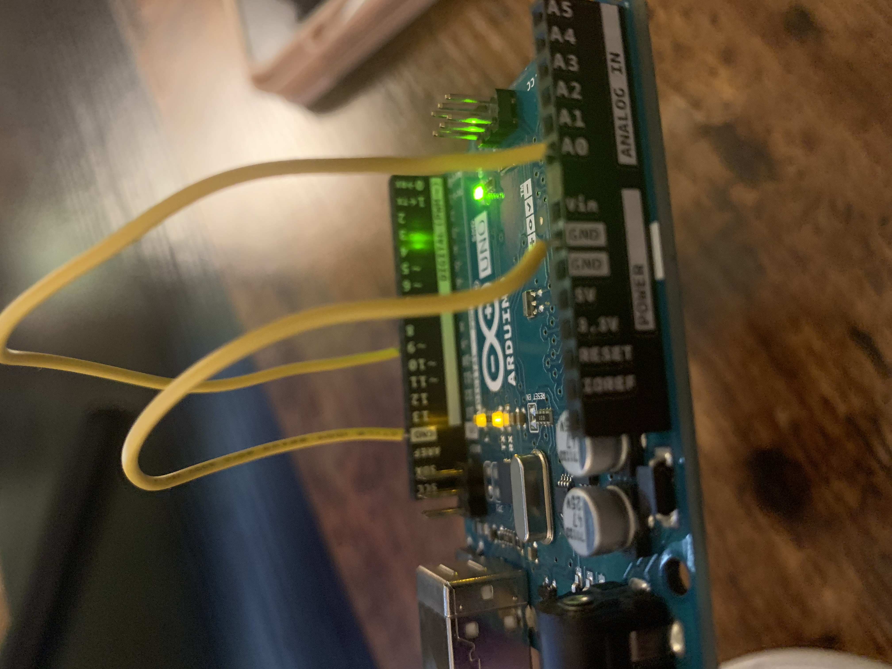
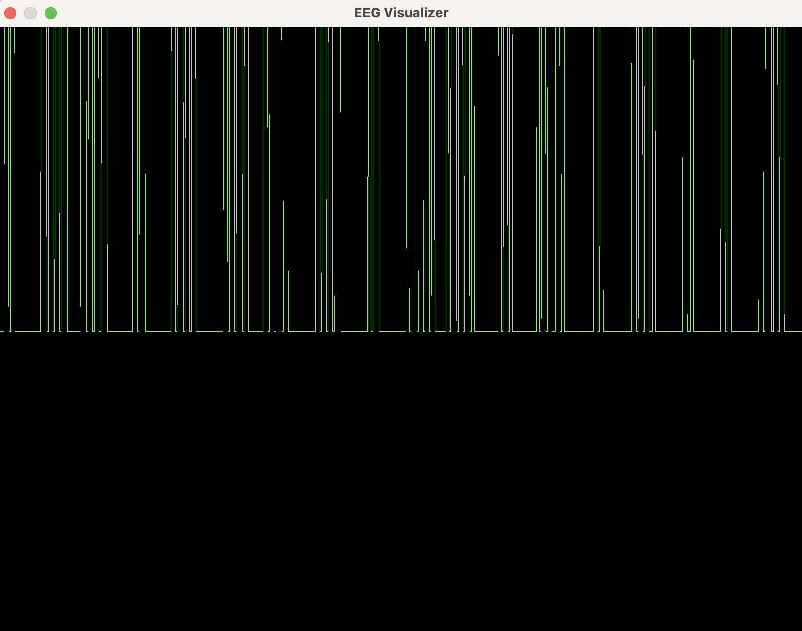

# Circuit Documentation
Here I document the circuits tested at each step while building the EEG. I wanted to test the 
SW side of things before hooking up electrodes to my scalp, so I used the Arduino Uno to generate a
square wave signal with a duty cycle of 50% to drive some circuits, which each circuit getting 
progressivly closer to the signal chain needed to handle the electrode signal. 

The order of progression for the circuits are:

1. square wave only circuit
2. low-pass filter circuit
3. pre-amp circuit
	* single op-amp
	* instrumentation amplifier
4. signal chain circuit
	* idk do i need this or is instrumentation amplifier enough?

## Square-Wave Only Circuit
The Arduino Uno is used to generate a square wave with 50% duty cycle from pin 9. Pin 9 is then 
connected directly to Pin A0 which sends the signal to the ADC on the ATmega328P chip and then 
to the serial port. The ATmega328P runs at 16MHz which is the clock speed for the ADC. However, the 
ADC clock speed can be divided by a prescaler value, which by default is 128. So, the ADC clock is 
really:

$$ ADC Clock = /frac{16 MHz}{128}  = 125 kHZ$$ 
Check the arduino sketch /eeg_project/firmware/arduino_read_square_wave/arduino_read_square_wave.ino
to see how to generate the square wave. 

According to the Uno documentation, the PWM pins output a sample at 490Hz. This means it takes 

### Pic of Circuit:

### Pic of Signal:

The square wave, when visualized, does not appear to have a 50% duty cycle. This is likely because
the A0 pin is not sampling at the exact rate that pin 9 is outputting the signal. I tried playing 
around with prescaler settings in the ADC, delays in both the sketch and the serial reading but
was unable to get it to sample at the right rate. Moved on in the interest of time. 

