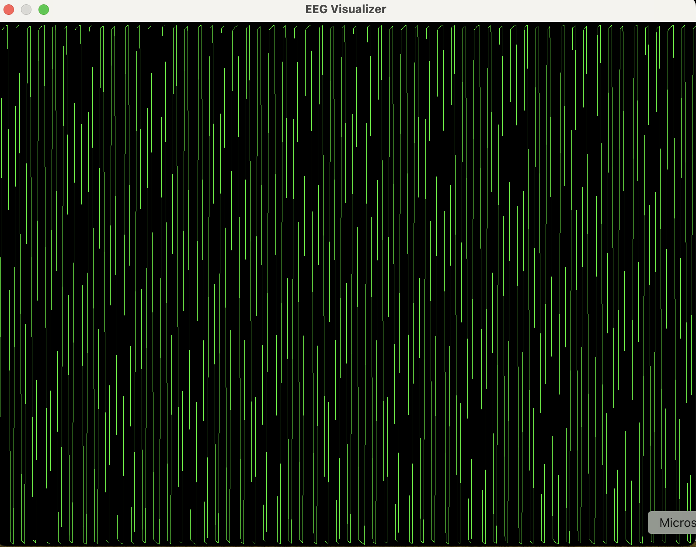
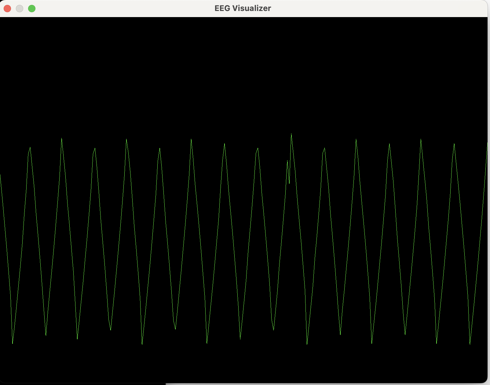

# Circuit Documentation
Here I document the circuits tested at each step while building the EEG. I wanted to test the 
SW side of things before hooking up electrodes to my scalp, so I used the Arduino Uno to generate a
square wave signal with a duty cycle of 50% to drive some circuits, with each circuit getting 
progressively closer to the signal chain needed to handle the electrode signal. 

The order of progression for the circuits are:

1. square wave only circuit
2. low-pass filter circuit
3. pre-amp circuit
	* single op-amp
	* instrumentation amplifier
4. signal chain circuit
	* idk do i need this or is instrumentation amplifier enough?

## Square-Wave Only Circuit
The Arduino Uno is used to generate a square wave with 50% duty cycle from pin 9. Pin 9 is then 
connected directly to Pin A0 which sends the signal to the ADC on the ATmega328P chip and then 
to the serial port. The ATmega328P runs at 16MHz which is the clock speed for the ADC. However, the 
ADC clock speed can be divided by a prescaler value, which by default is 128. So, the ADC clock is 
really (see https://www.gammon.com.au/adc for this info):

ADC Clock frequency = 16 MHz/128  = 125 kHZ

And the inverse of this gives the amount of time for one clock cycle:

ADC Clock cycle period = 1 / 125 kHz = 8 microseconds

But it takes 13 clock cycles for a single analog-to-digital-conversion, which gives

Time for one conversion = 13 * 8 microsecond = 104 microseconds 

Which gives a sampling rate (ignoring first sample which takes 25 clock cycles to initialize registers and such) of 

Pin A0 sampling rate ~ 1 / 104 microseconds = 9.6 kHz.

Which is more than fast enough to sample a 490 Hz square wave to avoid aliasing. We can see from the picture of
the signal below that it is a square wave with the correct duty cycle. I should add a y-axis into the EEG visualizater (TODO). 

Check the [arduino sketch](../firmware/arduino_read_square_wave/arduino_read_square_wave.ino)
to see how to generate the square wave. 

Now, a bit later, I ended up using an AWG for generating the square wave, so the pics below show this. But I leave the
documentation of the Uno approach for future reference. The AWG generated a cleaner signal than the Uno. 

### Pic of Circuit:

### Pic of Signal:
** NOTE: This is using the AWG as the input waveform, not the UNO **

## Low-Pass Filter Circuit
In theory, it's possible to turn the square wave into a sine wave.  Here we will examine this by passing the square
wave from above into a simple RC circuit, also called a 'low-pass filter' circuit.  This consists of a resistor 
connected in series with a capacitor. 

I've chosen R = 1 kOhm   and C = 1 microFarad which gives a time constant tau = 1ms. This should be very close to the frequency of
the square wave which is 490 kHz coming from pin 9 of the Uno. (Note, this is not the sampling frequency as discussed above).
Square wave frequency of 490 Hz corresponds to a period of 2.04 ms, so having a time constant of 1ms gives us the right amount of timing
to modulate one pulse of the square wave. [Working through the calculation](RC_circuit.pdf)  we can see that our smoothed square wave will oscillate 
between about 1.3 V to 3.7 V. 

 
(Obsolete: Use the same [arduino sketch](../firmware/arduino_read_square_wave/arduino_read_square_wave.ino) as above.) The pic 
below was generated using the AWG in the lab. 
### Pic of Circuit:

Measuring the voltage across the capacitor and visualizing, we see that the voltage is modulated away from a square wave to something
resembling more sinusoidal (although it's still rather sharp and irregular). 
### Pic of Signal:

